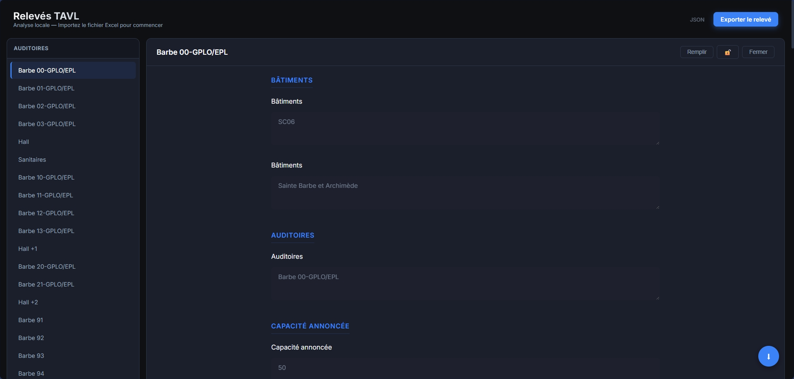

# Outil de Relevés TAVL

Outil web pour importer, éditer et exporter des fichiers de relevés Excel.

## Fonctionnalités

### Principales

- **Import Excel** : Chargement de fichiers `.xlsx` (glisser-déposer). Analyse automatique de la structure du fichier (Catégories, Questions, Types de données).
- **Interface Premium** : Interface sombre et moderne optimisée pour la lisibilité.
- **Thème sombre/clair** : Possibilité de passer d'un thème clair à sombre avec détection automatique des préférence de l'utilisateur.
- **Formulaires Dynamiques** : Champs de saisie générés basés sur les en-têtes Excel :

  - **Boutons Radio** : `v/f` (Vrai/Faux) et `o/n` (Oui/Non).
  - **Sélecteurs Trois États** : `G/M/F` (Gradin/Mobile/Fixe).
  - **Sélecteurs de Date** : Calendrier avec format standard (`dd/mm/yyyy`).
  - **Entrées Intelligentes** : Champs numériques et zones de texte extensibles.
- **Navigation Latérale** : Liste des "Auditoires" générée dynamiquement.
- **Sauvegarde Automatique** : Les modifications sont persistantes localement (IndexedDB). Restauration de session disponible au rechargement.

  
- **Export Intelligent** : Exporte vers XLSX en préservant **le formatage original** (couleurs, polices, bordures).

### Outils Avancés

- **Protection Lecture Seule** : Les champs structurels critiques (Bâtiment, Auditoire, Capacité annoncée) sont verrouillés par défaut pour éviter les modifications accidentelles.
- **Mode Édition Forcée (🔓)** : Déverrouille temporairement tous les champs via l'icône de cadenas dans l'en-tête.
- **Remplissage Magique (⚡)** : Automatise le remplissage des champs standards :
  - Définit la Date sur "Aujourd'hui".
  - Copie la "Capacité annoncée" vers "Capacité réelle" si vide.
  - Définit 'Oui'/'Vrai' pour les vérifications standards.
  - **Exception Intelligente** : Définit 'Non' pour les attributs négatifs comme "Humidité" ou "Infiltration".
  - **Sécurité** : Ignore les champs facultatifs standards.
- **Navigation Intelligente (⬇)** : Bouton d'action flottant personnalisé :
  - Saute au **prochain champ obligatoire vide**.
  - Commence la recherche *après* le champ actuellement focalisé.
  - Revient au début du formulaire si nécessaire.
  - Saute les boutons radio frères pour une traversée plus rapide.
- **Recherche & Filtrage (🔍)** :
  - Recherche filtrée en temps réel en haut du formulaire.
  - Filtre instantanément les questions et catégories visibles basés sur des mots-clés.
- **Suivi de Progression** :
  - **Indicateurs Latéraux** : Une coche verte (✔) apparaît automatiquement pour les Auditoires complétés à plus de 60%.
- **Badges & Validation** :
  - **(Facultatif)** : Les champs optionnels (détectés via des cellules Excel grises/hachurées) sont clairement marqués.
  - **Test Manuel Requis** : Remplace les libellés "(testé)" par un badge rouge clair.
  - **Dates Propres** : Les dates sont exportées en texte (`dd/mm/yyyy`) pour assurer une compatibilité parfaite avec Excel sans erreur de fuseau horaire.

## Guide Utilisateur

1. **Ouvrir** : Lancez `index.html` dans un navigateur moderne (Chrome, Edge).
2. **Importer** : Glissez-déposez votre fichier `.xlsx` (ex: `Barbe.xlsx`).

    
3. **Naviguer** : Cliquez sur un nom d'Auditoire dans la barre latérale.
4. **Éditer** :

   - Naviguez avec Tab ou utilisez le **Bouton ⬇** pour sauter à la prochaine tâche vide.
   - Utilisez **⚡ Remplir** pour pré-remplir les valeurs standards "Tout est bon" pour une salle.
   - Si une erreur structurelle existe dans la source, utilisez **🔓 Déverrouiller** pour la corriger.

   
5. **Exporter** : Cliquez sur **"Exporter le relevé"** pour télécharger le fichier complété.

## Structure Excel & Contraintes

L'outil repose sur une structure "Matrice" spécifique dans le fichier Excel.

### Lignes Critiques (Positions Fixes)

- **Ligne 3** : **Catégories** (En-tête Principal, ex: "Mobilier", "Sécurité").
- **Ligne 4** : **Questions** (En-tête Secondaire, ex: "Nombre de places", "Extincteur présent ?").
- **Ligne 5** : **Types de Données** (Définit le type d'entrée).

### Types de Données Supportés (Ligne 5 - Insensible à la casse)

- `v/f` : Vrai/Faux
- `o/n` : Oui/Non
- `date` ou `..date..` : Sélecteur de date
- `nombre` : Entrée numérique
- `gmf` : Gradin/Mobile/Fixe (Trois états)
- `text` (ou vide) : Zone de texte par défaut

### Mots-clés & Dépendances Logiques

Certaines fonctionnalités reposent sur des mots-clés spécifiques dans la **Ligne 3 (Catégorie)** ou la **Ligne 4 (Question)**. Ces règles sont **Sensibles aux Mots-clés** (correspondance partielle, insensible à la casse).

| Fonctionnalité               | Mots-clés Déencheurs (dans Catégorie ou Question)   | Effet                                                   |
| :---------------------------- | :----------------------------------------------------- | :------------------------------------------------------ |
| **Identité**           | `Auditoires`                                         | Identifie la colonne utilisée pour la liste latérale. |
| **Lecture Seule**       | `Bâtiment`, `Auditoires`, `Capacité annoncée` | Verrouille le champ.                                    |
| **Remplissage Magique** | `Capacité réelle`, `Réellement fonctionnelles`  | Copie la valeur de "Capacité annoncée".               |
| **Remplissage Magique** | `Date de passage`                                    | Remplit avec la date d'Aujourd'hui.                     |
| **Remplissage Magique** | `Humidité`, `Infiltration`                        | Définit par défaut "Non" (N) au lieu de "Oui".        |
| **GMF**                 | `Gradin` + `Mobile`                                | Force le type radio GMF si non spécifié.              |

### Modifications Sûres (Ce que vous pouvez changer dans Excel)

- ✅ **Ajouter des Colonnes** : Vous pouvez ajouter de nouvelles colonnes n'importe où si elles ont des en-têtes dans les lignes 3, 4, 5.
- ✅ **Renommer les En-têtes** : Vous pouvez renommer la plupart des en-têtes, **SAUF** ceux contenant les mots-clés listés ci-dessus si vous voulez garder la logique spéciale qui leur est attachée.
- ✅ **Changer les Couleurs** :
  - **Remplissage Motif/Hachures** : Toute cellule avec un remplissage à motif (points, lignes) sera détectée comme **Facultatif**.
  - **Couleurs Unies** : Préservées à l'export mais ignorées par la logique.

### Modifications Risquées (Ce qui casse l'outil)

- ❌ **Déplacer les Lignes d'En-tête** : Les lignes 3, 4, 5 **DOIVENT** rester les lignes d'en-tête. N'insérez pas de lignes au-dessus.
- ❌ **Supprimer la Colonne d'Identité** : Une colonne doit avoir "Auditoires" dans l'en-tête pour générer la liste.

## Technologies

- **HTML5 / CSS3** (Vanilla)
- **JavaScript** (ES6+)
- **ExcelJS** : Pour la lecture/écriture Excel haute fidélité.
- **IndexedDB** : Pour la persistance locale des données.
